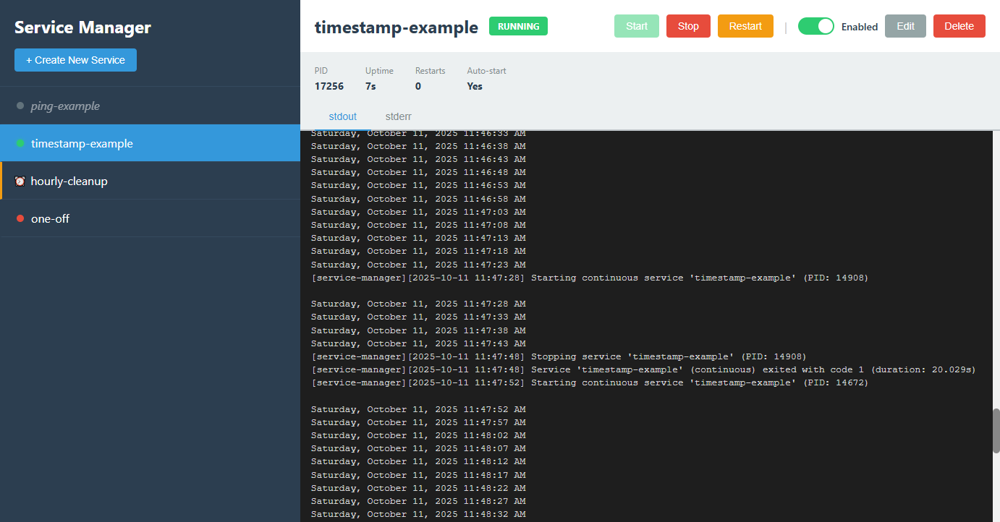

# Service Manager



A simple service manager with a web-based management portal for running and monitoring multiple services.

## Features

- **Continuous services**: Long-running processes with auto-restart on crash
- **Scheduled services**: Cron-based task scheduling
- **Web management UI**: Control, monitor, and view live logs on port 4321
- **Auto-reload**: Detects config changes and applies them automatically
- **Flexible configuration**: Define services in YAML with custom commands, args, environment variables, and working directories

## Installation

Install directly from GitHub:

```bash
go install github.com/mrexodia/service-manager@latest
```

Or build from source:

```bash
git clone https://github.com/mrexodia/service-manager.git
cd service-manager
go build
```

## Configuration

Services are defined in `services.yaml`. Example:

```yaml
services:
  # Continuous service (long-running)
  - name: my-service
    command: /path/to/executable
    args:
      - --arg1
      - value1
    workdir: /working/directory
    env:
      KEY1: value1
      KEY2: value2
    enabled: true  # Optional: Set to false to disable auto-start

  # Scheduled service (cron-based)
  - name: cleanup-job
    command: /path/to/cleanup-script
    args:
      - --deep-clean
    schedule: "0 2 * * *"  # Run daily at 2:00 AM
    enabled: true
```

### Configuration Fields

- `name` (required): Unique service identifier
- `command` (required): Executable path or command
- `args` (optional): List of command-line arguments
- `workdir` (optional): Working directory for the service
- `env` (optional): Environment variables as key-value pairs
- `enabled` (optional): If `false`, service won't auto-start (default: `true`)
- `schedule` (optional): Cron expression for scheduled services (5 fields: minute, hour, day, month, weekday)

### Cron Schedule Syntax

Scheduled services use standard cron syntax with 5 fields (minute, hour, day, month, weekday). See [cron.help](https://cron.help/) for interactive examples and syntax help.

Examples:
- `*/5 * * * *` - Every 5 minutes
- `0 2 * * *` - Daily at 2:00 AM
- `0 0 * * 0` - Weekly on Sunday at midnight

### Auto-Reload

The service manager monitors `services.yaml` and automatically reloads when changes are detected (checked every 5 seconds). The web UI will reflect changes without requiring a restart.

## Usage

1. Start the service manager:
   ```bash
   service-manager
   ```
   Or if you built from source: `go run .` or `./service-manager`

2. Open your browser to `http://localhost:4321`

3. Use the web UI to:
   - View all services in the left sidebar (⏰ icon for scheduled services)
   - Click a service to view logs and details
   - **Continuous services**: Start/Stop/Restart
   - **Scheduled services**: Run Now, Enable/Disable toggle
   - View next run time and last run stats for scheduled services
   - Edit service configuration
   - Create new services
   - Delete services

## Logs

Service logs are written to:
- `logs/{service-name}-stdout.log`
- `logs/{service-name}-stderr.log`

The web UI shows the last ~10KB of logs plus live streaming.

## Stopping

Press `Ctrl+C` to stop the service manager and all managed services.
